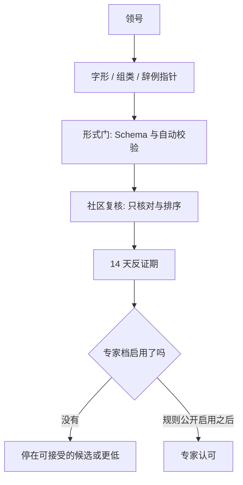

# 甲骨文未释字协作释读

[](https://github.com/horizoncove/oracle-bone-decipher/actions/workflows/validate.yml)

一个公开的协作整理仓库：把尚未有共识的甲骨文字形、辞例和既有说法登记清楚，让任何人都能按同一套规则补充和反证。

它不承诺“破译”。这里的任何文字都不是定论。

English: a public workspace for organizing undeciphered oracle-bone graphs. It does not promise a decipherment, and nothing in the repository is a final reading.

## 愿景

把未释字的指针、辞例和争议放在可以复查的文件里。贡献者负责录入和查重，复核者对照著录，反证期留给具体反例。模型如果被用到，只能提供线索。

English: keep pointers, contexts, and disputes in files that other people can check. Models may suggest; they do not decide.

## 为什么做

未释字分散在字编、论文和数据集里，编号体系也不相同。本仓库用自己的不透明编号 `OBD-######`，不沿用 HUST-OBC 或其他数据集的字头号。外部字头的对应放到单独的 crosswalk，可以以后再填。

English: published numbers do not match each other. This project mints its own opaque ids and keeps crosswalks separate.

## 公益宣言

本项目无偿，服务公共研究。项目不收费，不接受商业化运作，维护者不从项目获利。

代码是 [MIT](LICENSE)，社区释读内容是 [CC BY 4.0](LICENSE-CONTENT)。这两种许可按其文本允许他人在遵守条款时商业性再利用。上面的宣言只约束本项目如何运营，不把许可改成非商业许可。

English: the project does not charge and maintainers do not profit from it. MIT and CC BY 4.0 still permit reuse under those licenses. The declaration is operational, not a different license.

## 如何参与

1. 读 [新手第一任务](docs/first-tasks.md)（中英）。
2. 读 [贡献指南](CONTRIBUTING.md)、[行为准则](CODE_OF_CONDUCT.md)、[治理](GOVERNANCE.md)。
3. 用 Issue 模板领号、登记、提案或建议数据源。模板在 `.github/ISSUE_TEMPLATE/`。
4. 提问：仓库设置里打开 GitHub Discussions 之后再用 Discussions。不要假定它已经打开。本页不指向任何外部社群。

日、韩、法、德译文尚未撰写，目录在 [docs/i18n/README.md](docs/i18n/README.md)，以中文版为准。英文短帖草稿：[docs/recruiting/en-intro.md](docs/recruiting/en-intro.md)。

## 工作流



“可接受的候选”固定表示：未经专家评审，仅表示证据齐备、尚无已知反例。社区票不能把“有争议”改成认可。AI 相似度不算证据。

细节：[架构](docs/architecture.md)、[评审](docs/review-process.md)、[证据清单](docs/evidence-checklist.md)、[路线图](docs/ROADMAP.md)。

## 登记与样例

三层说明见 [registry/README.md](registry/README.md)。三件样例 `OBD-000001` 至 `OBD-000003` 都标了“示例数据，非真实释读”。

`OBD-900001` 至 `OBD-900099` 永不发给真实字形。演练在 [pilot/_drill/](pilot/_drill/README.md)，校验会跑，发布和统计排除它。研究日志空白模板：[pilot/_TEMPLATE.md](pilot/_TEMPLATE.md)。甲骨文有一形多用，只比字形不够，要先看用法。`corpus_scope` 还要写缀合库查询日期。

## 许可与数据

- 代码：[LICENSE](LICENSE)（MIT）
- 释读内容：[LICENSE-CONTENT](LICENSE-CONTENT)（CC BY 4.0）
- 数据集只外链：[docs/datasets.md](docs/datasets.md)，说明见 [data/README.md](data/README.md)
- HUST-OBC 论文为 CC BY-NC 4.0，不入库。Figshare 元数据写成 CC BY 4.0，差异待确认
- OBC306、Oracle-50K：待确认，不使用

著录号统一到哪一套，待确认。著录释文能否录入，版权待确认。符号是否对齐某部著录体例，待确认。

## 校验

```bash
pip install -r requirements-dev.txt
python scripts/validate_all.py
python -m unittest discover -s tests -v
```

拉取请求上的工作流会做 Schema、编号、辞例、双录、试点日志、Markdown 链接和单元测试。演练目录包含在校验里，不包含在 `python scripts/stats.py` 的发布口径里。

## 免责声明

本项目是协作研究平台。它不宣称任何释读为定论。所有仍有争议的说法都要经过公开规则；“专家认可”目前空置。模型输出不是证据。

向中国文字博物馆提交报告的路径写在 [报告模板](docs/report-template.md)。投递方式待补充。本仓库不提供电话或邮箱。

## 致谢

登记格式和流程是为本仓库设计的。上游研究只作为外链，不表示那些作者认可本仓库：

- HUST-OBC：Wang 等，*Scientific Data*，2024，<https://doi.org/10.1038/s41597-024-03807-x>
- OBSD：Guan 等，arXiv:2406.00684，<https://github.com/guanhaisu/OBSD>。2026-10-02 复核为公开仓库，根目录无 LICENSE 文件。说明见 [tools/README.md](tools/README.md)。权重与数据集不入库。
- 不必依赖字表全文的可读页面调查：[docs/source-survey-2026-10-02-readable.md](docs/source-survey-2026-10-02-readable.md)。其中一条公开页可供以后做指针。本次没有登记真实字形。

适配器没有接上推理，见 [tools/README.md](tools/README.md)。

## English summary

The repository is a non-commercial public workspace: it does not charge, and maintainers do not profit from it. Code is MIT and contributed readings are CC BY 4.0; both licenses allow reuse under their terms. Sample records are fictional. Drill ids OBD-900001–OBD-900099 are reserved. Expert endorsement is vacant. Model similarity is not evidence. Several dataset licenses and the museum delivery method remain unconfirmed on purpose.
