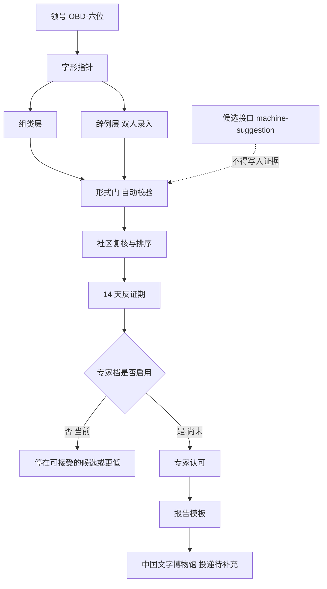

# 逻辑架构

数据流：

1. 领号。测试段 OBD-900001 至 OBD-900099 跳过。
2. 字形层只存指针、来源、摹写状态、疑似关系。
3. 组类层存分期组类。新手不写终判。
4. 辞例层存自录释文。双录比对。
5. 候选接口读指针，写出带 `machine-suggestion` 的记录并写日志。档案的证据字段不能引用它。
6. 形式门校验 Schema、编号、辞例封顶、图像与域名、试点日志。
7. 社区票只排序。
8. 反证期结束且没有未回应的实质反例，才可能到“可接受的候选”。
9. “专家认可”空置。报告模板因此不会进入发送。
10. 演练日志在 `pilot/_drill/`。校验会跑，发布和统计排除该目录。

crosswalk 单独存放外部字头对应，可后补。

## English

Registration is pointers, not images. Model output is logged and cannot be cited as evidence. Drill logs are validated and then left out of published counts.
